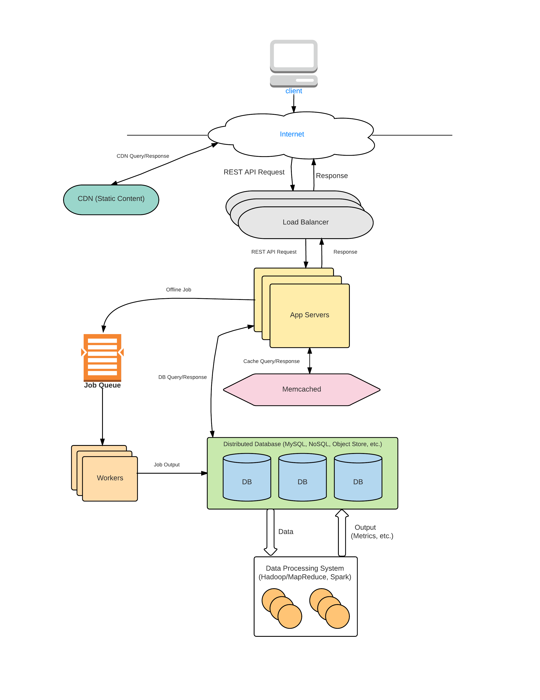
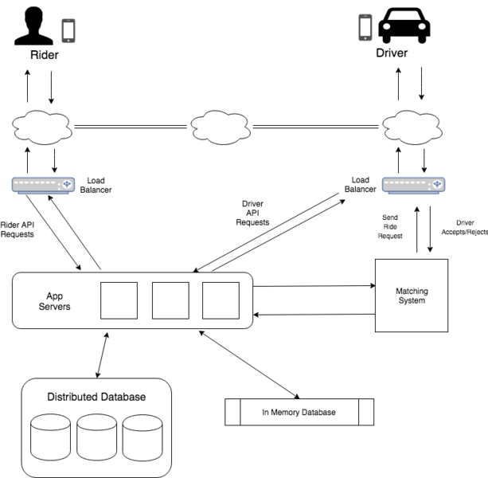

# First Step: List out specifications, features and use cases

- You need to come up with a high level design

# Scalable Web Application

- Single Server
- Vertical Scaling (increasing ram, HDD etc)
- Horizontal Scaling (multiple Servers)

# Multiple Servers

- Load balancers to multiple servers (not very efficient) cuz they have to
  communicate with each other
- Better way: Distrubuted cache, distributed storage, distributed web server

# Approaching System Design Interviews

- Types

1. Open Ended Service (facebook, instagram, Uber, tinyUrl)
2. Specific System (load balancer, API Rate Limiter, Task Scheduler)
3. Object Oriented Design (Chess Game, Parking Lot)

## Steps

1. **F**: Define 2-3 core **Features**
2. **U**: Use Cases
3. **S**: What to **Store** (not DB Model)
4. **H**: **High Level** Design
5. **D**: **Detailed** Design

# Uber/Lyft System Design

# Features

1. Save User & Drive Profiles
2. Hail Ride

# Use Cases

| Rider               | Driver                |
| ------------------- | --------------------- |
| Request Ride        | Accept/Reject Request |
| Get ETA             | Pick up passenger     |
| Ride to Destination | Drive                 |
|                     | End Ride              |

# Store 

- Rider State
  - Not Riding
  - Requesting
  - Waiting 
  - Riding
- Driver State
  - Waiting
  - Requesting
  - Picking up
  - Driving
- Ride 

# High LEvel Design 

**Assumptions**: Backend Design for millions of users 

